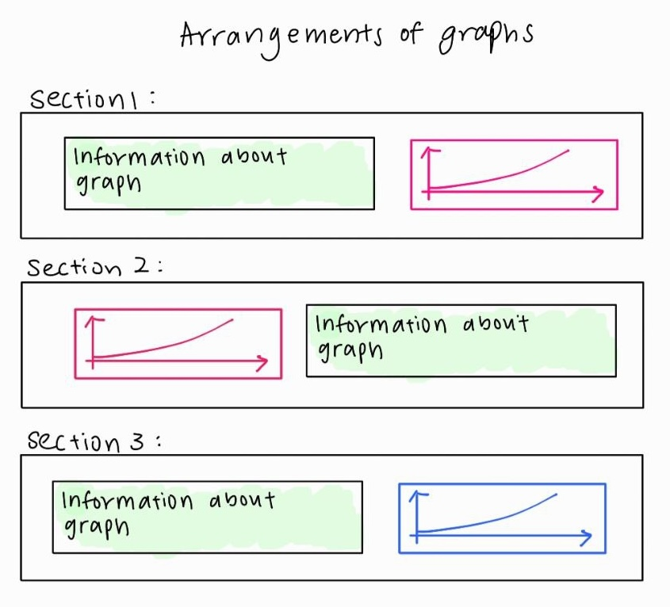
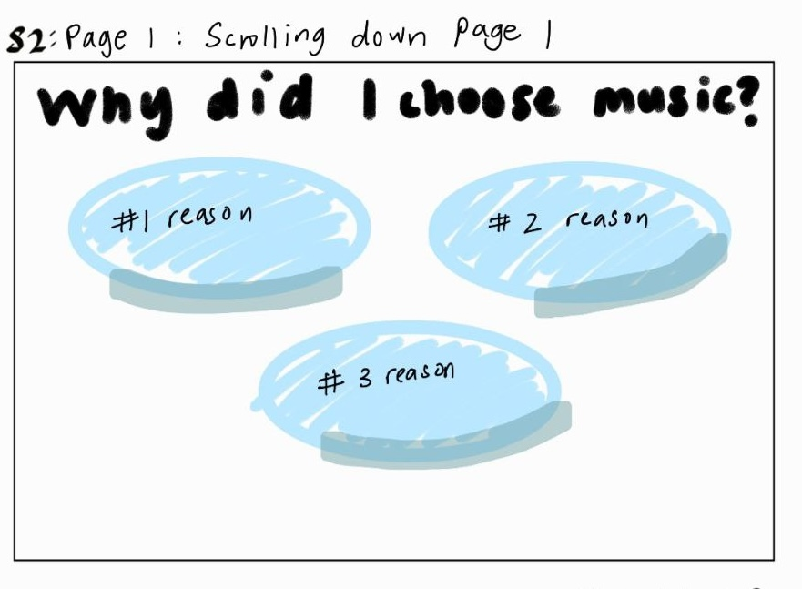

```{r setup, include=FALSE}
knitr::opts_chunk$set(echo = TRUE)
library(shiny)
library(tidyverse)
```

<h1 style="text-align:center;">

Topic

</h1>

#### My topic is to investigate the <i>synergy between Spotify songs and YouTube videos through data visualization</i>, uncovering how music performance on both platforms interplays and influences audience engagement and trends. I will be identifying the top trends and characteristics with popular youtube videos and spotify tracks.

<h1 style="text-align:center;">

Data Sources

</h1>

#### The following datasets from Kaggle to explore my topics were used:

##### 1. Global Youtube Statistics 2023 : <https://www.kaggle.com/datasets/nelgiriyewithana/global-youtube-statistics-2023?rvi=1>

##### 2. Spotify and Youtube: <https://www.kaggle.com/datasets/salvatorerastelli/spotify-and-youtube/data>

### Week 9 Diary:

##### For week 9, I have planned out the rough layout of my app using some sketches I did on my tablet, however these will be executed in the later weeks when I hopefully firm up my webpage. Here are the following content:

``` {r, out.height= "300px",out.width= "300px",echo= FALSE,eval=TRUE,fig.cap="How I plan my introduction page to be",}
 
```

``` {r, out.height= "300px",out.width= "300px",echo= FALSE,eval=TRUE,fig.cap="Arrangement of my graphs",}
 
```

``` {r, out.height= "300px",out.width= "300px",echo= FALSE,eval=TRUE,fig.cap="Some graphs that I plan to use",}
knitr::include_graphics("Pic_2.jpg") 
```

``` {r, out.height= "300px",out.width= "300px",echo= FALSE,eval=TRUE,fig.cap="Why I chose these datasets",}
 
```

