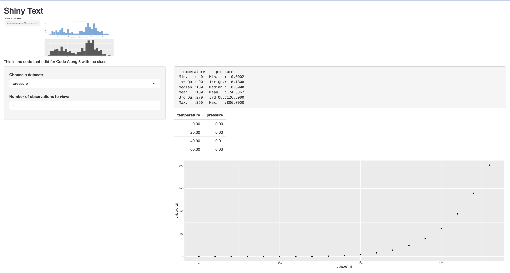

```{r setup, include=FALSE}
knitr::opts_chunk$set(echo = TRUE)
```


``` {r,eval=TRUE,echo=TRUE}

```{r, out.height= "500px",out.width= "500px",echo= FALSE,eval=TRUE,fig.cap="This is a random picture from my mac"}
 
```